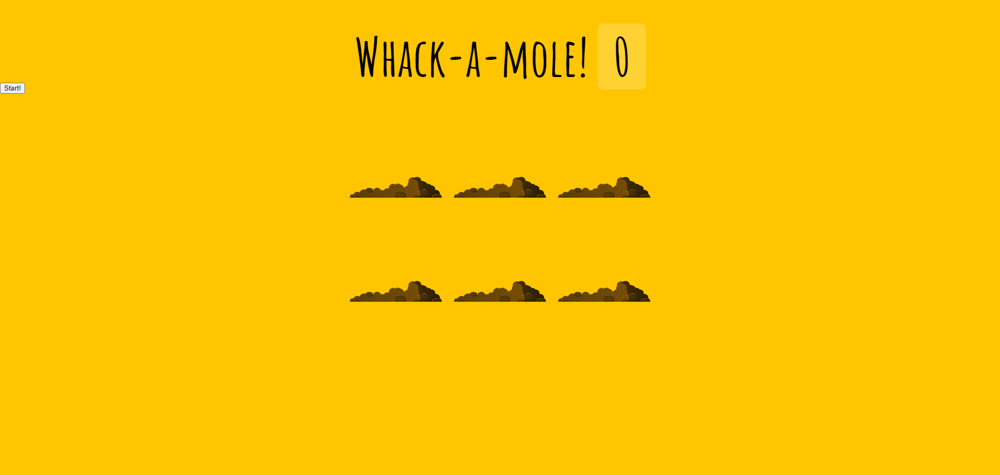
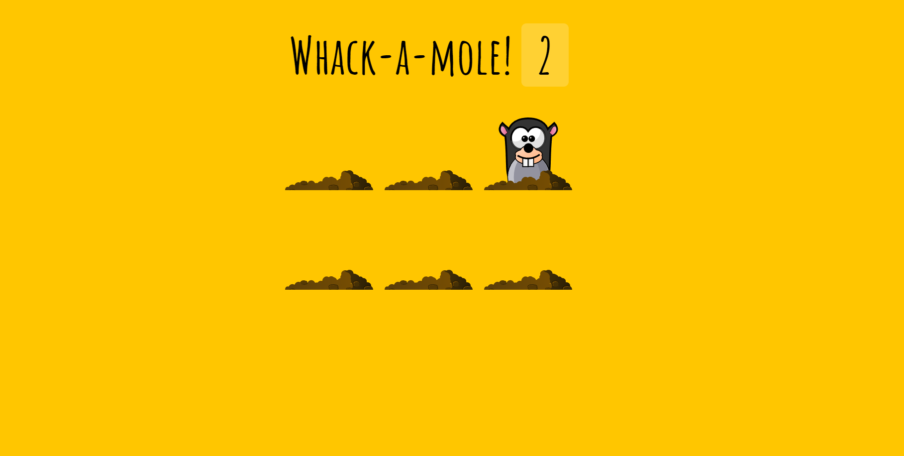

<h1 align="center" id="top">Whack A Mole</h1>
&#xa0;

<a href="https://rahymcharyyev.github.io/Whack-A-Mole/">Demo</a>

&#xa0;

  

  

  

  <!--  -->

  

  

<!-- Status -->

<!-- <h4 align="center">
	🚧  30   Whack A Mole 🚀 Under construction...  🚧
</h4>

 -->

  <a href="#dart-about">About</a> &#xa0; | &#xa0; 
  <a href="#rocket-technologies">Technologies</a> &#xa0; | &#xa0;
  <a href="#screenshots">Screenshots</a> &#xa0; | &#xa0;
  <a href="#contacts" target="_blank">Contacts</a>

 

## :dart: About

This small project that was created using a course from Wes Bos. You need to whack a mole by mouse clicking.

## :rocket: Technologies

The following tools were used in this project:

- [HTML](https://developer.mozilla.org/ru/docs/Web/HTML)
- [CSS](https://developer.mozilla.org/ru/docs/Web/CSS/Reference)
- [Javascript](https://developer.mozilla.org/en-US/docs/Web/JavaScript)

## 🖼️: Screenshots

 \
&#xa0;
 \
&#xa0;

## :memo: Contact

Made with :heart: by <a href="https://github.com/Rahym Charyyev" target="_blank">Rahym Charyyev</a>

&#xa0;

<a href="#top">Back to top</a>
